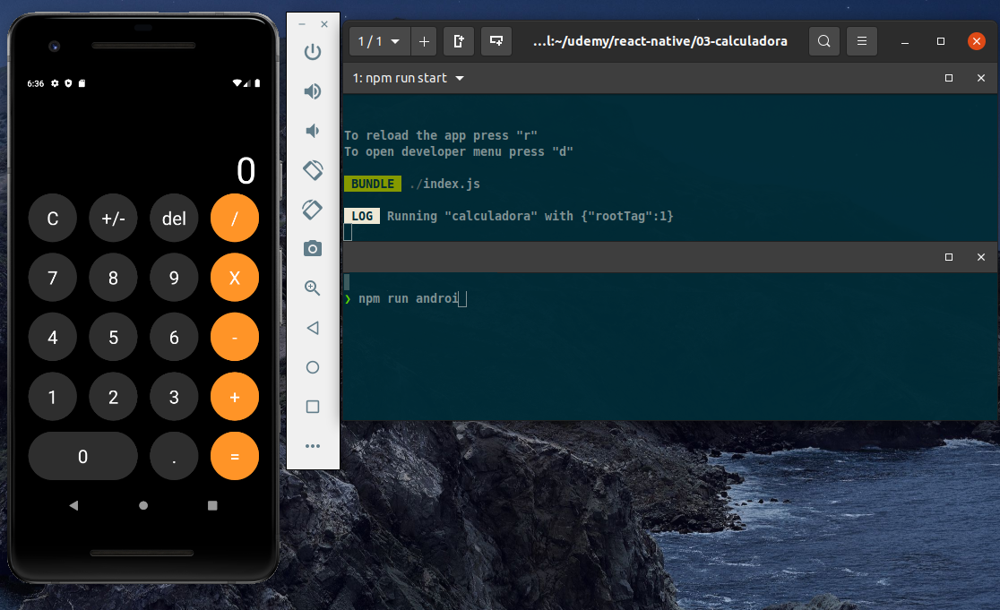

# reactNative-calculadora

## install npm packages
``` 
npm install
```
or
```
npm i
```
## start metro
Responsible for the compilation, installation and livereload of emulators
``` 
npm run start
```

## start android emulator
``` 
npm run android 
```

## start ios emulator
``` 
npm run ios
```
[](App Image)